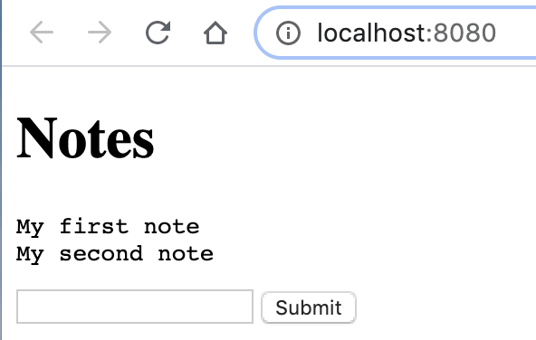

## Examples

Here's a gallery of useful examples. Do you have a useful example? PR welcome!

### Delete a list of files returned by a Unix command

```
find . | grep conflict | bb -i '(doseq [f *input*] (.delete (io/file f)))'
```

### Calculate aggregate size of directory

``` clojure
#!/usr/bin/env bb

(as-> (io/file (or (first *command-line-args*) ".")) $
  (file-seq $)
  (map #(.length %) $)
  (reduce + $)
  (/ $ (* 1024 1024))
  (println (str (int $) "M")))
```

``` shellsession
$ dir-size
130M

$ dir-size ~/Dropbox/bin
233M
```


### Shuffle the lines of a file

``` shellsession
$ cat /tmp/test.txt
1 Hello
2 Clojure
3 Babashka
4 Goodbye

$ < /tmp/test.txt bb -io '(shuffle *input*)'
3 Babashka
2 Clojure
4 Goodbye
1 Hello
```

### Fetch latest Github release tag

``` shell
(require '[clojure.java.shell :refer [sh]]
         '[cheshire.core :as json])

(defn babashka-latest-version []
  (-> (sh "curl" "https://api.github.com/repos/borkdude/babashka/tags")
      :out
      (json/parse-string true)
      first
      :name))

(babashka-latest-version) ;;=> "v0.0.73"
```

### Generate deps.edn entry for a gitlib

``` clojure
#!/usr/bin/env bb

(require '[clojure.java.shell :refer [sh]]
         '[clojure.string :as str])

(let [[username project branch] *command-line-args*
      branch (or branch "master")
      url (str "https://github.com/" username "/" project)
      sha (-> (sh "git" "ls-remote" url branch)
              :out
              (str/split #"\s")
              first)]
  {:git/url url
   :sha sha})
```

``` shell
$ gitlib.clj nate fs
{:git/url "https://github.com/nate/fs", :sha "75b9fcd399ac37cb4f9752a4c7a6755f3fbbc000"}
$ clj -Sdeps "{:deps {fs $(gitlib.clj nate fs)}}" \
  -e "(require '[nate.fs :as fs]) (fs/creation-time \".\")"
#object[java.nio.file.attribute.FileTime 0x5c748168 "2019-07-05T14:06:26Z"]
```

### View download statistics from Clojars

Contributed by [@plexus](https://github.com/plexus).

``` shellsession
$ curl https://clojars.org/stats/all.edn |
bb -o '(for [[[group art] counts] *input*] (str (reduce + (vals counts))  " " group "/" art))' |
sort -rn |
less
14113842 clojure-complete/clojure-complete
9065525 clj-time/clj-time
8504122 cheshire/cheshire
...
```

### Portable tree command

See [examples/tree.clj](https://github.com/borkdude/babashka/blob/master/examples/tree.clj).

``` shellsession
$ clojure -Sdeps '{:deps {org.clojure/tools.cli {:mvn/version "0.4.2"}}}' examples/tree.clj src
src
└── babashka
    ├── impl
    │   ├── tools
    │   │   └── cli.clj
...

$ examples/tree.clj src
src
└── babashka
    ├── impl
    │   ├── tools
    │   │   └── cli.clj
...
```

### List outdated maven dependencies

See [examples/outdated.clj](https://github.com/borkdude/babashka/blob/master/examples/outdated.clj).
Inspired by an idea from [@seancorfield](https://github.com/seancorfield).

``` shellsession
$ cat /tmp/deps.edn
{:deps {cheshire {:mvn/version "5.8.1"}
        clj-http {:mvn/version "3.4.0"}}}

$ examples/outdated.clj /tmp/deps.edn
clj-http/clj-http can be upgraded from 3.4.0 to 3.10.0
cheshire/cheshire can be upgraded from 5.8.1 to 5.9.0
```

### Convert project.clj to deps.edn

Contributed by [@plexus](https://github.com/plexus).

``` shellsession
$ cat project.clj |
sed -e 's/#=//g' -e 's/~@//g' -e 's/~//g' |
bb '(let [{:keys [dependencies source-paths resource-paths]} (apply hash-map (drop 3 *input*))]
  {:paths (into source-paths resource-paths)
   :deps (into {} (for [[d v] dependencies] [d {:mvn/version v}]))}) ' |
jet --pretty > deps.edn
```

A script with the same goal can be found [here](https://gist.github.com/swlkr/3f346c66410e5c60c59530c4413a248e#gistcomment-3232605).

### Print current time in California

See [examples/pst.clj](https://github.com/borkdude/babashka/blob/master/examples/pst.clj)

### Tiny http server

See [examples/http_server.clj](https://github.com/borkdude/babashka/blob/master/examples/http_server.clj)

Original by [@souenzzo](https://gist.github.com/souenzzo/a959a4c5b8c0c90df76fe33bb7dfe201)

### Print random docstring

See [examples/random_doc.clj](https://github.com/borkdude/babashka/blob/master/examples/random_doc.clj)

``` shell
$ examples/random_doc.clj
-------------------------
clojure.core/ffirst
([x])
  Same as (first (first x))
```

### Cryptographic hash

`sha1.clj`:
``` clojure
#!/usr/bin/env bb

(defn sha1
  [s]
  (let [hashed (.digest (java.security.MessageDigest/getInstance "SHA-1")
                        (.getBytes s))
        sw (java.io.StringWriter.)]
    (binding [*out* sw]
      (doseq [byte hashed]
        (print (format "%02X" byte))))
    (str sw)))

(sha1 (first *command-line-args*))
```

``` shell
$ sha1.clj babashka
"0AB318BE3A646EEB1E592781CBFE4AE59701EDDF"
```

### Package script as Docker image

`Dockerfile`:
``` dockerfile
FROM borkdude/babashka
RUN echo $'\
(println "Your command line args:" *command-line-args*)\
'\
>> script.clj

ENTRYPOINT ["bb", "script.clj"]
```

``` shell
$ docker build . -t script
...
$ docker run --rm script 1 2 3
Your command line args: (1 2 3)
```

### Extract single file from zip

``` clojure
;; Given the following:

;; $ echo 'contents' > file
;; $ zip zipfile.zip file
;; $ rm file

;; we extract the single file from the zip archive using java.nio:

(import '[java.nio.file Files FileSystems CopyOption])
(let [zip-file (io/file "zipfile.zip")
      file (io/file "file")
      fs (FileSystems/newFileSystem (.toPath zip-file) nil)
      file-in-zip (.getPath fs "file" (into-array String []))]
  (Files/copy file-in-zip (.toPath file)
              (into-array CopyOption [])))
```

### Note taking app

See
[examples/notes.clj](https://github.com/borkdude/babashka/blob/master/examples/notes.clj). This
is a variation on the
[http-server](https://github.com/borkdude/babashka/#tiny-http-server)
example. If you get prompted with a login, use `admin`/`admin`.



### which

The `which` command re-implemented in Clojure. See
[examples/which.clj](https://github.com/borkdude/babashka/blob/master/examples/which.clj).
Prints the canonical file name.

``` shell
$ examples/which.clj rg
/usr/local/Cellar/ripgrep/11.0.1/bin/rg
```

### pom.xml version

A script to retrieve the version from a `pom.xml` file. See
[examples/pom_version.clj](../examples/pom_version.clj). Written by [@wilkerlucio](https://github.com/wilkerlucio).

### Whatsapp frequencies

Show frequencies of messages by user in Whatsapp group chats.
See [examples/whatsapp_frequencies.clj](../examples/whatsapp_frequencies.clj)

### Find unused vars

[This](../examples/hsqldb_unused_vars.clj) script invokes clj-kondo, stores
returned data in an in memory HSQLDB database and prints the result of a query
which finds unused vars. It uses
[pod-babashka-hsqldb](https://github.com/borkdude/pod-babashka-hsqldb).

``` shell
$ bb examples/hsqldb_unused_vars.clj src

|                   :VARS/NS |               :VARS/NAME |                     :VARS/FILENAME | :VARS/ROW | :VARS/COL |
|----------------------------+--------------------------+------------------------------------+-----------+-----------|
| babashka.impl.bencode.core |           read-netstring | src/babashka/impl/bencode/core.clj |       162 |         1 |
| babashka.impl.bencode.core |          write-netstring | src/babashka/impl/bencode/core.clj |       201 |         1 |
|      babashka.impl.classes | generate-reflection-file |      src/babashka/impl/classes.clj |       230 |         1 |
|    babashka.impl.classpath |      ->DirectoryResolver |    src/babashka/impl/classpath.clj |        12 |         1 |
|    babashka.impl.classpath |        ->JarFileResolver |    src/babashka/impl/classpath.clj |        37 |         1 |
|    babashka.impl.classpath |                 ->Loader |    src/babashka/impl/classpath.clj |        47 |         1 |
| babashka.impl.clojure.test |            file-position | src/babashka/impl/clojure/test.clj |       286 |         1 |
| babashka.impl.nrepl-server |             stop-server! | src/babashka/impl/nrepl_server.clj |       179 |         1 |
|              babashka.main |                    -main |              src/babashka/main.clj |       485 |         1 |
```

### List contents of jar file

For the code see [examples/ls_jar.clj](../examples/ls_jar.clj).

``` shell
$ ls_jar.clj borkdude/sci 0.0.13-alpha.24
META-INF/MANIFEST.MF
META-INF/maven/borkdude/sci/pom.xml
META-INF/leiningen/borkdude/sci/project.clj
...
```
