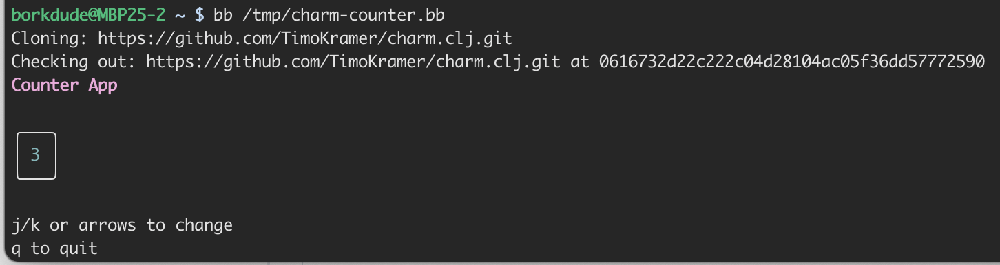
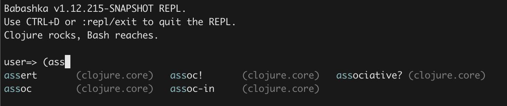
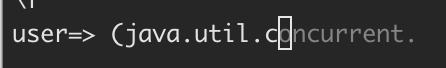

# Babashka 1.12.215: Revenge of the TUIs

[Babashka](https://babashka.org) is a fast-starting native Clojure scripting
runtime. It uses [SCI](https://github.com/babashka/sci) to interpret Clojure and
compiles to a native binary via GraalVM, giving you Clojure's power with
near-instant startup. It's commonly used for shell scripting, build tooling, and
small CLI applications. If you don't yet have bb installed, you can with brew:

```
brew install borkdude/brew/babashka
```

or bash:

```
bash <(curl -s https://raw.githubusercontent.com/babashka/babashka/master/install)
```

This release is, in my opinion, a game changer. With JLine3 bundled, you can
now build full terminal user interfaces in babashka. The `bb repl` has been
completely overhauled with multi-line editing, completions, and eldoc. `deftype`
now supports map interfaces, making bb more compatible with existing libraries
like `core.cache`. SCI has had many small improvements, making `riddley`
compatible too. Riddley is used in Cloverage, a code coverage library for
Clojure, which now also works with babashka (Cloverage PR pending).

## Babashka conf 2026

But first, let me mention an exciting upcoming event! [Babashka
conf](https://babashka.org/conf/) is happening again for the second time! The
first time was 2023 in Berlin. This time it's in Amsterdam. The Call for
Proposals is open until the end of February, so there is still time to submit
your talk or workshop. We are also looking for one last gold sponsor (500 euros) to
cover all costs.

## Highlights

### JLine3 and TUI support

Babashka now bundles [JLine3](https://github.com/jline/jline3), a Java library
for building interactive terminal applications. You get terminals, line readers
with history and tab completion, styled output, keyboard bindings, and the
ability to `reify` custom completers, parsers, and widgets — all from bb
scripts.

JLine3 works on all platforms, including Windows PowerShell and cmd.exe.

Here's a simple interactive prompt that reads lines from the user until EOF
(Ctrl+D):

```clojure
(import '[org.jline.terminal TerminalBuilder]
        '[org.jline.reader LineReaderBuilder])

(let [terminal (-> (TerminalBuilder/builder) (.build))
      reader   (-> (LineReaderBuilder/builder)
                   (.terminal terminal)
                   (.build))]
  (try
    (loop []
      (when-let [line (.readLine reader "prompt> ")]
        (println "You typed:" line)
        (recur)))
    (catch org.jline.reader.EndOfFileException _
      (println "Goodbye!"))
    (finally
      (.close terminal))))
```

### babashka.terminal namespace

A new `babashka.terminal` namespace exposes a `tty?` function to detect whether
stdin, stdout, or stderr is connected to a terminal:

```clojure
(require '[babashka.terminal :refer [tty?]])

(when (tty? :stdout)
  (println "Interactive terminal detected, enabling colors"))
```

This accepts `:stdin`, `:stdout`, or `:stderr` as argument. It uses JLine3's
terminal provider under the hood.

This is useful for scripts that want to behave differently when piped vs.
run interactively, for example enabling colored output or progress bars only
in a terminal.

### charm.clj compatibility

[charm.clj](https://github.com/TimoKramer/charm.clj) is a new Clojure library
for building terminal user interfaces using the Elm architecture
(Model-Update-View). It provides components like spinners, text inputs, lists,
paginators, and progress bars, with support for ANSI/256/true color styling and
keyboard/mouse input handling.

charm.clj is now compatible with babashka (or rather, babashka is now compatible
with charm.clj), enabled by the combination of JLine3 support and other
interpreter improvements in this release. This means you can
build rich TUI applications that start instantly as native binaries.

Here's a complete counter example you can save as a single file and run with `bb`:

```clojure
#!/usr/bin/env bb

(babashka.deps/add-deps
 '{:deps {io.github.TimoKramer/charm.clj {:git/sha "cf7a6c2fcfcccc44fcf04996e264183aa49a70d6"}}})

(require '[charm.core :as charm])

(def title-style
  (charm/style :fg charm/magenta :bold true))

(def count-style
  (charm/style :fg charm/cyan
               :padding [0 1]
               :border charm/rounded-border))

(defn update-fn [state msg]
  (cond
    (or (charm/key-match? msg "q")
        (charm/key-match? msg "ctrl+c"))
    [state charm/quit-cmd]

    (or (charm/key-match? msg "k")
        (charm/key-match? msg :up))
    [(update state :count inc) nil]

    (or (charm/key-match? msg "j")
        (charm/key-match? msg :down))
    [(update state :count dec) nil]

    :else
    [state nil]))

(defn view [state]
  (str (charm/render title-style "Counter App") "\n\n"
       (charm/render count-style (str (:count state))) "\n\n"
       "j/k or arrows to change\n"
       "q to quit"))

(charm/run {:init {:count 0}
            :update update-fn
            :view view
            :alt-screen true})
```



More examples can be found [here](https://github.com/TimoKramer/charm.clj/tree/main/docs/examples#readme).

### Deftype with map interfaces

Until now, `deftype` in babashka couldn't implement JVM interfaces like
`IPersistentMap`, `ILookup`, or `Associative`. This meant libraries that define
custom map-like types, a very common Clojure pattern, couldn't work in babashka.

Starting with this release, `deftype` supports map interfaces. Your `deftype`
must declare `IPersistentMap` to signal that you want a full map type. Other
map-related interfaces like `ILookup`, `Associative`, `Counted`, `Seqable`, and
`Iterable` are accepted freely since the underlying class already implements
them.

This unlocks several libraries that were previously incompatible:

- [core.cache](https://github.com/clojure/core.cache): all cache types
  (BasicCache, FIFOCache, LRUCache, TTLCache, LUCache) work unmodified
- [linked](https://github.com/frankiesardo/linked): insertion-ordered maps and
  sets

### Riddley and Cloverage compatibility

[Riddley](https://github.com/clj-commons/riddley) is a Clojure library for code
walking that many other libraries depend on. Previously, SCI's `deftype` and
`case` did not macroexpand to the same special forms as JVM Clojure, which broke
riddley's walker. Several changes now align SCI's behavior with Clojure:
`deftype` macroexpands to `deftype*`, `case` to `case*`, and `macroexpand-1` now
accepts an optional env map as second argument (inspired by how the CLJS analyzer
API works). Together these changes enable riddley and tools built on it, like
[cloverage](https://github.com/cloverage/cloverage) and
[Specter](https://github.com/redplanetlabs/specter), to work with bb.

Riddley has moved to [clj-commons](https://github.com/clj-commons/riddley),
thanks to [Zach Tellman](https://github.com/ztellman) for transferring it. I'd
like to thank Zach for all his contributions to the Clojure community over the
years. Version 0.2.2 includes bb compatibility, which was one of the first PRs
merged after the transfer. Cloverage compatibility has been [submitted
upstream](https://github.com/cloverage/cloverage/pull/356), all 75 cloverage
tests pass on both JVM and babashka.

### Console REPL improvements

The `bb repl` experience has been significantly improved with JLine3 integration.
You no longer need `rlwrap` to get a comfortable console REPL:

- Multi-line editing: the REPL detects incomplete forms and continues reading
  on the next line with a `#_=> ` continuation prompt
- Tab completion: Clojure-aware completions powered by SCI, including
  keywords (`:foo`, `::foo`, `::alias/foo`)



- Ghost text: as you type, the common completion prefix appears as faint
  inline text after the cursor. Press TAB to accept.



- Eldoc: automatic argument help — when your cursor is inside a function
  call like `(map |)`, the arglists are displayed below the prompt
- Doc-at-point: press Ctrl+X Ctrl+D to show full documentation for the
  symbol at the cursor
- Persistent history: command history saved across sessions in
  `~/.bb_repl_history`
- Ctrl+C handling: first press on an empty prompt warns, second press exits

Many of these features were inspired by
[rebel-readline](https://github.com/bhauman/rebel-readline),
[Leiningen](https://leiningen.org/)'s REPL, and
[Node.js](https://nodejs.org/)'s REPL.

### SCI improvements

Under the hood, [SCI](https://github.com/babashka/sci) (the interpreter
powering babashka) received many improvements in this cycle:

- Functional interface adaptation for instance targets: you can now write
  `(let [^Predicate p even?] (.test p 42))` and SCI will adapt the Clojure
  function to the functional interface automatically.
- Type tag inference: SCI now infers type tags from `let` binding values to
  binding names, reducing the need for explicit type hints in interop-heavy code.
- Several bug fixes: `read` with `nil`/`false` as eof-value, `letfn` with
  duplicate function names, `ns-map` not reflecting shadowed vars, NPE in
  `resolve`, and `.method` on class objects routing incorrectly.

### Other improvements

- Support multiple `catch` clauses in combination with `^:sci/error`
- Fix `satisfies?` on protocols with `proxy`
- Support `reify` with `java.time.temporal.TemporalQuery`
- Fix `reify` with methods returning `int`/`short`/`byte`/`float` primitives
- nREPL server now uses non-daemon threads so the process stays alive without
  `@(promise)`
- Add `clojure.test.junit` as built-in source namespace
- Add cp437 (IBM437) charset support in native binary via selective GraalVM
  charset Feature, avoiding the ~5MB binary size increase from `AddAllCharsets`.
  More charsets can be added on request.

For the full list of changes including new Java classes and library bumps, see
the [changelog](https://github.com/babashka/babashka/blob/master/CHANGELOG.md).

## Thanks

Thank you to all the contributors who helped make this release possible. Special
thanks to everyone who reported issues, tested pre-release builds from
[babashka-dev-builds](https://github.com/babashka/babashka-dev-builds), and
provided feedback.

Thanks to [Clojurists Together](https://www.clojuriststogether.org/) and all
babashka [sponsors](https://github.com/sponsors/borkdude) and
[contributors](https://github.com/babashka/babashka/graphs/contributors) for
their ongoing support. Your sponsorship makes it possible to keep developing
babashka.

And thanks to all babashka users: you make this project what it is. Happy
scripting!

